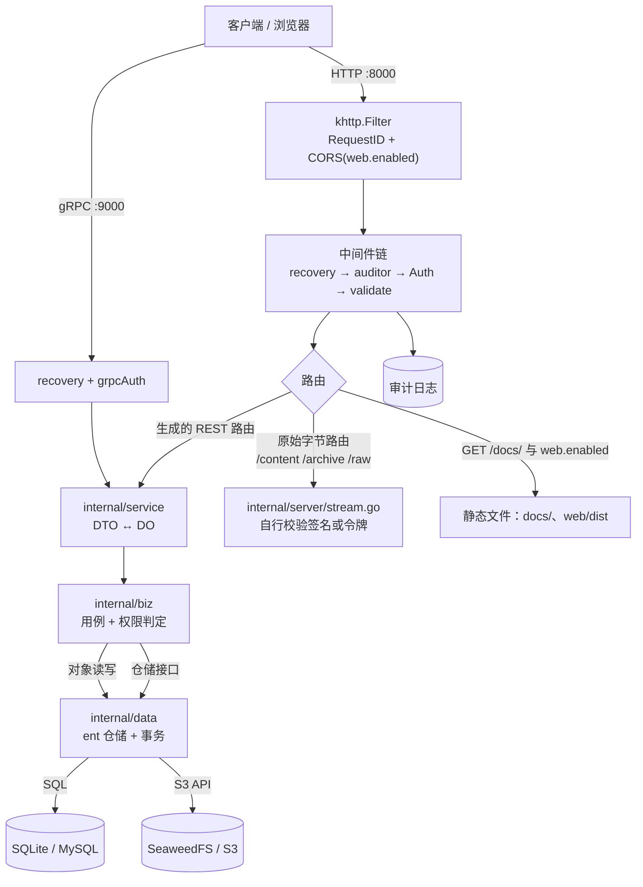

# 架构

本文说明 Nagisa 网盘后端从请求入口到对象存储的完整路径、分层约束、并发与原子性模型、SQLite 与对象存储的取舍，以及扩展项目时该走哪些步骤。

## 1. 请求路径



同一份用例同时服务两种传输：`service` 只做 DTO ↔ DO 转换与入参校验，因此 HTTP 与 gRPC 的行为由同一段领域代码决定。

| 环节 | HTTP | gRPC |
| --- | --- | --- |
| 恢复 | `recovery.Recovery()` | `recovery.Recovery()` |
| 审计 | `Auditor.Middleware()`（在鉴权之外，失败调用也会记录） | 无 |
| 身份 | `middleware.Auth`，读 `Authorization` 与 `X-Node-Token` | `grpcAuth`，读同名 metadata |
| 必填字段 | `validate.Validator` + `fieldbehavior.ValidateRequiredFields` | 无 |
| CORS | 仅当 `web.enabled` 为 true 时挂载 | 不适用 |
| 编解码 | `internal/server/codec.go`（protobuf JSON） | protobuf 二进制 |

原始字节路由（`GET /v1/files/{node_id}/content`、`GET /v1/files/{node_id}/archive`、`PUT /v1/files/uploads/{upload_id}/parts/{part_number}/raw`）通过 `srv.Route("/", rawRecovery)` 注册在生成的路由之外，因此不经过中间件链：读操作靠签名 URL 自证身份，分片上传靠请求头里的访问令牌自行鉴权。

## 2. 分层：DTO / DO / PO

三种模型穿过三层，`biz` 拥有 DO，`data` 拥有 PO，`service` 只在边界做转换。

```text
   client ──► DTO ──► service ──► DO ──► biz ──► DO ──► data ──► PO ──► storage
                                  ▲                ▲
                                  │ declares       │ implements
                                  └─── repo IF ────┘

   DTO  Data Transfer Object — proto 请求/响应
   DO   Domain Object        — 纯领域模型，无 proto、无存储标签
   PO   Persistent Object    — 存储形态，由 data 拥有
```

| 层 | 拥有 | 边界上说 | 绝不接触 |
| --- | --- | --- | --- |
| `service` | — | DTO ↔ DO | PO、存储客户端 |
| `biz` | DO | DO | DTO、PO、存储客户端 |
| `data` | PO | DO ↔ PO | DTO |

依赖规则与理由：

| 规则 | 理由 |
| --- | --- |
| `service` 只 import `api/...` 与 `biz`，不 import `data` | 传输层不该知道行数、SQL 与连接池；换存储实现不应改到 handler |
| `biz` 只 import `api/...` 里的错误原因枚举，不 import `service`/`data` | 领域层必须能在没有 HTTP、没有数据库的测试里跑；`biz/access_test.go` 就是这样验证访问规则的 |
| 仓储接口在 `biz` 声明、在 `data` 实现 | 这是依赖倒置的接缝：`biz` 定义它需要的能力，`data` 去满足，方向始终指向内层 |
| PO 类型只在 `internal/data` 内可见 | 存储形态（列名、可空性、驱动专用 builder）变化时，上层无需改动 |
| 驱动错误在仓储内映射成 `biz` 错误 | 上层永远不需要 `if errors.Is(err, sql.ErrNoRows)`；`biz` 只暴露语义化错误 |
| 只有 `cmd` 通过 Wire 把各层接起来 | 装配是唯一需要同时看到所有层的场合，其它地方出现跨层 import 就是分层 bug |
| DO 的 id 由领域层铸造（`biz.NewID()`，UUIDv7） | 物化路径 `path` 必须在写库之前算出来，所以标识符不能依赖数据库自增 |

`service` 的写法约定：每个资源一个 `convert<Resource>` 负责入参，回包在返回点就地构造；列表请求统一走 `parseList` / `parseOrderedList` / `parsePagedList` 解析 AIP 的 `filter` / `order_by` / `page_size` / `page_token`；`Update<Resource>` 按 `update_mask` 的路径逐项取值，未列出的路径一律不写。

## 3. 一次写请求的时间线

以 `CreateFolder` 为例（`internal/biz/node.go`）：

```text
1. 取上下文里的 Caller（中间件已放好），未认证 → UNAUTHENTICATED
2. caller.Require(PERMISSION_UPLOAD)                    账号级权限上限
3. 校验并规范化名称（非空、不含 / \ NUL、长度 ≤ storage.max_name_length）
4. tx.WithTx:                                            ← 进入写事务（进程内互斥）
     a. loadWritableParent：目标文件夹存在、是文件夹、未在回收站，且调用方在其上持有 upload
     b. 深度检查 parent.Depth + 1 < storage.max_path_depth
     c. resolveName：按 conflict_policy 处理同名（FAIL → NETDISK_NAME_CONFLICT）
     d. 铸造 UUIDv7，计算 path = parent.Path + id + "/"、depth = parent.Depth + 1
     e. 插入节点行
     f. 如有 ACL：prepareAcl（只允许 PermNodeScope 且必须是调用方权限的子集）后整体替换
     g. AddUsage(owner, 0, 0, +1)
5. 提交；失败则整段回滚，ACL 与计数一并撤销
```

进入事务后所有仓储调用都从 context 里取事务句柄（`Data.Exec(ctx)`），所以一次用例跨多个仓储仍然是一个原子单元。

## 4. 并发与原子性

### 4.1 写事务被进程级互斥锁串行化

`internal/data/data.go` 的 `Data.WithTx` 在 `BEGIN` 之前先取 `d.writeMu`，提交或回滚后才释放：

```go
d.writeMu.Lock()
defer d.writeMu.Unlock()
tx, err := d.db.Tx(ctx)
...
```

理由：SQLite 任意时刻只允许一个写者，而本项目的正确性依赖「先读后写」的序列（同名检查后插入、配额检查后写入、路径前缀重写等）。把互斥锁放在事务外层，意味着这些序列不会被另一个写者插入。嵌套调用（`WithTx` 里再调 `WithTx`）检测到 context 里已有事务时直接内联执行，不会开第二个事务，也就不会自锁。

读路径不取锁，直接走连接池；WAL 让读不阻塞写。

### 4.2 各操作的原子性保证

| 操作 | 事务边界 | 保证 |
| --- | --- | --- |
| `CreateFolder` | 名称解析 + 插入 + ACL 替换 + 计数 | 全部成功或全部回滚；ACL 里任何一条非法都会让建目录失败 |
| `UpdateNode` | 重命名 / 移动 / 描述 / 元数据 / 可见范围 / 密码 | 单事务内完成；重命名先查重再改名 |
| `MoveNodes` | 整批节点在同一事务内 | 批内任何一个节点被拒绝（无编辑权、目标在自身子树内、超深度、重名），整批移动全部回滚 |
| `CopyNodes` | 整批同上；对象先复制、行后写入 | 失败只可能残留多余对象，不会产生指向空内容的节点 |
| `DeleteNodes`（回收站） | 按 `path` 前缀把子树状态置为 `TRASHED` | 一次 `UPDATE ... WHERE path LIKE prefix%`，父子状态不会只改一半 |
| `RestoreNodes` | 逐个还原 + 重写路径 + 状态翻转 | 同一事务；原目录已不存在时回退到根目录 |
| `PurgeNodes` | 删除行 + 删除 ACL + 回退用量 | 一个事务内完成（见 4.4 的对象释放说明） |
| `CompleteUpload` | 组装对象 → 提交节点/版本/计数 | 对象先组装，事务失败则删除刚组装的对象；树永远不会指向不存在的内容 |
| `AbortUpload` | 会话状态 + 分片行 | 状态与分片记录同事务，随后删除暂存前缀，失败进队列 |
| `DeleteNodeVersion` | 版本行 + 版本计数 | 对象键在提交后才进待删除队列 |
| `DeleteUser` | 吊销会话 + 软删除 | 同一事务；账号行保留为 `USER_STATUS_DELETED` |

### 4.3 顺序原则：先对象、后行；删除排到提交之后

两条铁律：

1. **写入时先落对象，再写行。** `CompleteUpload`、`UploadSmallFile`、`CopyNodes` 都是先 `PutObject` / `ComposeObject` / 复制对象，成功后才在事务里建行。事务失败就把刚写的对象删掉。结果是任何时刻「行指向的内容一定存在」，崩溃最多留下无人引用的对象。
2. **删除时先提交行，再删对象。** 行删除在事务里提交成功之后，才去动对象存储；如果这一步失败，就把对象键写入待删除队列，而不是把已经对客户端成功的操作报成失败。

`CompleteUpload` 的收尾正是这条：

```
组装 finalKey（ComposeObject）
  └─ 校验 sha256（upload.verify_checksum 为真且声明了 sha256: 前缀的摘要）
  └─ tx：创建/覆盖节点、保留旧版本、更新用量
        └─ 失败：删除 finalKey，返回错误
  └─ 提交成功后：
        DeleteUploadParts(会话) 失败 → EnqueueDeletion(upload.Path, "upload_parts")
        否则 RemovePrefix(upload.Path) 失败 → EnqueueDeletion(upload.Path, "upload_parts")
        最后 DeleteUpload(会话行)
```

### 4.4 待删除队列与维护任务

`pending_deletions` 表（`storage_key` / `reason` / `attempts` / `last_error`）保存「提交后才需要释放」的对象键。写入方：

| reason | 触发点 |
| --- | --- |
| `upload_parts` | 完成上传后清理暂存分片失败 |
| `upload_abort` | 取消上传后删除暂存前缀失败 |
| `upload_expired` | `expire_uploads` 任务把超时会话置为 `EXPIRED` |
| `version_trim` | 版本数超过 `upload.max_versions` 被裁剪 |
| `version_delete` | 显式删除某个历史版本 |

消费方是维护任务 `purge_deletions`：一次取最多 500 条（按 `created_at` 升序），对每条调用 `RemovePrefix(key)`，成功则删除队列行，失败则 `attempts + 1` 并记录 `last_error`，留给下一轮重试。由于使用的是「按前缀删除」，队列里既可以放单个对象键，也可以放 `uploads/<uploadId>` 这样的前缀。

触发方式有两种：手动 `POST /v1/system/maintenance/run`（`tasks: ["purge_deletions"]` 或不传 `tasks` 走默认组合），或由外部 cron 定时调用；进程本身不内置调度器。

**当前实现的注意点**（源码行为，非设计承诺）：

- `PurgeNodes` 在事务内删除行、ACL 与用量计数，并把被删节点的当前内容键与全部历史版本键写入待删除队列（`node_purge` / `node_purge_version`），由 `purge_deletions` 任务在提交后真正释放对象。因此 `reclaimed_bytes` 是本次彻底删除所对应的字节数，而对象存储的占用会在下一次 `purge_deletions` 后下降。
- `gc_orphans` 只扫描 `uploads/` 与 `orphan/` 两个前缀，并对每个仍处于 `PENDING` / `IN_PROGRESS` 且未过期的上传会话保留其 `uploads/<upload_id>/` 前缀，因此**在途上传的分片不会被回收**；被回收的是已取消、已过期或已被清理的会话残留，以及运维手工归置到 `orphan/` 的对象。它对 `files/...` 与 `versions/...` 不做回收（这些由待删除队列负责）。

## 5. SQLite 相关取舍

### 5.1 连接与 pragma

`internal/data/data.go` 打开 SQLite 时把 pragma 作为 DSN 参数注入，逐连接生效：

| pragma | 何时加 | 作用 |
| --- | --- | --- |
| `journal_mode(WAL)` | `data.database.wal` 为 true 且 DSN 里没有 `journal_mode` | 读写并发：读不阻塞写、写不阻塞读；崩溃恢复更快 |
| `busy_timeout(ms)` | DSN 里没有 `busy_timeout` 时，默认 10s | 拿不到锁时等待而不是立刻返回 `SQLITE_BUSY` |
| `foreign_keys(1)` | `data.database.foreign_keys` 为 true 且 DSN 里没有 | 让外键约束真正生效（SQLite 默认关闭） |
| `synchronous(NORMAL)` | DSN 里没有 `synchronous` | WAL 下的常规取舍：进程崩溃不丢已提交事务，仅断电可能丢最后若干事务 |
| `_txlock=immediate` | DSN 里没有 `_txlock` | 事务以 IMMEDIATE 模式开始，一上来就取写锁。延迟（deferred）事务「先读后写」时需要升级锁，SQLite 会立刻拒绝这种升级而**不遵守 `busy_timeout`**，这是并发写者下 "database is locked" 的经典来源 |

连接池默认 `MaxOpenConns = 8`、`MaxIdleConns = MaxOpenConns`；`data.database.source` 缺省为 `file:nagisa.db?cache=shared`。驱动是纯 Go 的 `modernc.org/sqlite`（无需 CGO），同时注册了 `go-sql-driver/mysql`：`data.database.driver` 不是 sqlite 时走 `ent.Open(driver, source)` 分支，因此切换 MySQL 不需要改代码。

### 5.2 为什么有物化的 `path` 列

`path` 存的是祖先 id 串，形如 `/<id1>/<id2>/`（`biz.ChildPath`）。它把树操作降级成字符串前缀操作：

| 需求 | 用 `path` 的写法 | 不用 `path` 的代价 |
| --- | --- | --- |
| 列子树 | `WHERE path LIKE '<path>%'` | 递归 CTE 或逐层查询 |
| 移动子树 | 取旧前缀下所有行，重写为新前缀 + 残余 | 递归遍历每一层 |
| 回收站 / 还原 | `UPDATE ... WHERE path LIKE prefix%` 一次改完子树 | N 次更新 |
| 搜索范围限定 | 子树的 `path` 前缀 | 先遍历再过滤 |
| 深度限制 | 冗余的 `depth` 列，避免查一次算一次 | 每次递归计算 |

`database/ent/schema/node.go` 为 `path` 建了索引（非唯一），`internal/data/node.go` 的 `RelocateSubtree` 在调用方事务内逐行重写后代行——逐行而不是一条 SQL，是为了同时兼容 SQLite 与 MySQL 方言。

### 5.3 为什么不用 ent 的唯一索引（部分谓词），而用事务内校验

同级重名规则是「活跃兄弟之间唯一」。这个规则**不能**用一个无条件唯一索引表达，理由有三：

1. ent 的 `index.Fields(...).Unique()` 生成的是无条件唯一索引；「只对 `status = ACTIVE` 的行唯一」需要部分索引（partial index），SQLite / PostgreSQL 支持，MySQL 不支持，写成 schema 就失去了跨方言能力。
2. 移入回收站的行会保留名字。若无条件唯一索引生效，用户把 `report.pdf` 删除后就再也无法上传同名的 `report.pdf`——这与回收站语义冲突。
3. 唯一性还要和「同名策略」联动（`FAIL` 报错、`RENAME` 取 `base (1).ext`、`OVERWRITE` 走覆盖分支），这是业务决策，不是存储约束。

因此：`node` 表在 `(parent_id, name_lower)` 上建的是**普通**索引（把重名检查变成一次索引查找），唯一性由 `NodeUsecase.resolveName` 在写事务内做「查活跃兄弟 → 按策略决定」的检查；因为所有写事务被进程内互斥锁串行化，这个「先查后写」不会被并发插入破坏。相应地，其它天然唯一的资源仍用数据库唯一索引兜底：账号 `username`、分享 `token`、上传分片 `(upload_id, part_number)`、版本 `(node_id, version)`、设置 `key`、刷新令牌 `token_hash`。

`name_lower` 是 `name` 在 `storage.case_insensitive_names` 下的镜像列，让「大小写不敏感」也退化成一次等值查找；`NextAvailableName` 只统计活跃兄弟，保持扩展名在末尾（`report.pdf` → `report (1).pdf`）。

## 6. 对象存储

### 6.1 键布局

所有键都会再套上 `data.object_storage.prefix`（示例配置为 `netdisk`），即实际键是 `netdisk/files/...`。

| 键 | 产生位置 | 内容 |
| --- | --- | --- |
| `files/<owner_id>/<node_id>` | `biz.ObjectKey` | 一个节点的当前内容。上传完成、内联上传、复制目标都用它 |
| `uploads/<uploadId>/parts/<n>` | `Upload.Path` + `Upload.PartKey(n)` | 第 n 个分片（n 从 1 开始）。整场会话的所有分片都在 `uploads/<uploadId>/` 下，取消上传是一次前缀删除 |
| （无独立前缀） | — | 版本没有单独的键空间：覆盖写时旧内容的对象键保持不动（仍在 `files/<owner>/<旧节点 id>`），版本行直接指向该键，因此一个键始终只属于一个节点或一个版本 |
| `orphan/` | 无写入方 | `gc_orphans` 会扫描该前缀，当前没有代码往里写，留给运维手工归置待清理对象 |

### 6.2 分片如何组装

`CompleteUpload` 校验通过后调用 `ObjectStore.ComposeObject(ctx, dstKey, srcKeys, contentType)`。`internal/data/storage.go` 用 S3 的 **server-side multipart copy** 实现它：一次 `CreateMultipartUpload`，然后每个源对象一次 `UploadPartCopy`（`x-amz-copy-source`），最后 `CompleteMultipartUpload` 按 1..N 收口；任一步失败都会 `AbortMultipartUpload` 释放分片。服务端把 `uploads/<id>/parts/1..N` 按顺序拼成 `files/<owner>/<nodeId>`，**字节不经过 Nagisa 进程**。

**每个非末分片必须 ≥ 5 MiB**，这是 S3 multipart 的硬性规则，因此：

- `upload.min_chunk_size` 不得低于 `5242880`（`configs/config.yaml` 的注释与 `UploadLimits` 默认值都按这个约束设置）；
- `InitiateUpload` 把请求的 `chunk_size` 夹到 `[min_chunk_size, max_chunk_size]` 并对齐到 256 KiB；
- `CompleteUpload` 逐个校验：每片都存在、非末片大小 ≥ `min_chunk_size`、片数等于 `total_parts`、总字节数等于声明的 `size`，任何一条不满足都返回 `NETDISK_UPLOAD_INCOMPLETE`；
- 组装后的 ETag 与声明的 `sha256:` 摘要不一致时返回 `NETDISK_PRECONDITION_FAILED`（仅在 `upload.verify_checksum` 为真且声明了带前缀的摘要时校验），并删除刚组装的对象。

### 6.3 预签名与 public_endpoint

| 场景 | 签名方 | 说明 |
| --- | --- | --- |
| 分片直传 | `PresignPutObject` | 返回 PUT 地址与过期时刻；**不**附带 Content-Type 头，否则会破坏签名 |
| 文件下载 | `PresignGetObject` | 通过 `response-content-disposition` / `response-content-type` 参数控制文件名与内联/附件 |
| 服务端自签名的流式下载 | `internal/pkg/urlsign` | 绑定方法、路径、主体、节点、处置方式与过期时刻，用于 `/content` 与 `/archive` |

预签名 URL 的签名对象是**主机名**：URL 里出现哪个 host，签名就为哪个 host 计算。服务器访问对象存储的地址（`data.object_storage.endpoint`）与浏览器访问的地址（`public_endpoint`）不同时，必须配置 `public_endpoint`——`internal/data/storage.go` 会为它单独建一个 S3 客户端与 `PresignClient`，签名统一走这个「public」客户端（`presigner()`），否则浏览器拿到的地址校验必然失败。`public_endpoint` 为空或不等于 `endpoint` 时才会创建该客户端。寻址方式固定为 **path-style**，所以签名 URL 形如 `https://<public_endpoint>/<bucket>/<key>?X-Amz-...`。

有效期：`presign_ttl` 是基准（缺省 30 分钟），请求可以要求更短，但被夹在 `4 × presign_ttl` 以内；`SystemInfo.signed_url_ttl_seconds` 与 `signed_url_max_ttl_seconds` 就是这两者。分享链接的下载地址由 `ShareUsecase` 自己夹：请求值缺省 30 分钟，上限 4 小时。

### 6.4 后端不可用时的行为

`endpoint` 为空时 `objectStore` 以 `backendName = "none"` 构造：读/写/组装/预签名返回 `NETDISK_UNAVAILABLE`，而 `RemoveObject` / `RemovePrefix` 直接返回 nil。这样可以在没有对象存储的情况下跑通账号、权限、树结构与接口联调（`test/integration` 的冒烟测试就是这么做的），但任何真正的内容传输都会失败。`GET /v1/system/info` 的 `storage_backend` 会如实报告 `none` 或 `s3`。

## 7. 扩展项目

### 7.1 加一个资源的清单

1. **DTO**：在 `api/netdisk/v1/<resource>.proto` 定义 `Create<Resource>` / `Get<Resource>` / `List<Resources>` / `Update<Resource>` / `Delete<Resource>`，带 `google.api.http` 与 `google.api.field_behavior`，然后 `make api`。
2. **DO + 仓储接口**：在 `internal/biz` 声明 `<Resource>`（纯领域结构）与 `<Resource>Repo` 接口，用例只依赖接口；错误在这里用 `errors.NotFound` / `errors.BadRequest` + `v1.ErrorReason_*` 构造。
3. **仓储实现**：在 `internal/data` 实现接口并返回 `biz.<Resource>Repo`；存储形态与 DO 不一致时新增 PO，用 `new<Resource>(do)` / `toBiz(po)` 做转换，PO 不出包。需要 ent 表时先在 `internal/data/ent/schema/` 加 schema。
4. **装配**：把仓储构造器加进 `data.ProviderSet`，用例加进 `biz.ProviderSet`，服务加进 `service.ProviderSet`；在 `internal/server/http.go` 与 `grpc.go` 注册新的 HTTP/gRPC 服务；需要审计时在 `internal/server/middleware/audit.go` 的 `auditActions` 里补一行。
5. **重新生成**：`make all` 刷新 Wire、ent 与 `go.mod`。

### 7.2 生成命令

| 命令 | 生成内容 |
| --- | --- |
| `make init` | 安装 `wire@v0.7.0` 与 `buf` |
| `make api` | `buf generate --template buf.gen.yaml`：`protoc-gen-go`、`protoc-gen-go-grpc`、`protoc-gen-go-http`、`protoc-gen-openapi`（产出 `openapi.yaml`） |
| `make config` | `buf generate --template buf.gen.config.yaml`：`internal/conf/conf.pb.go` |
| `make generate` | `go generate ./...` 并 `go mod tidy`。生成指令是 `internal/data/ent/generate.go` 的 `ent generate ./schema`；Wire 的注入器改用 `go run github.com/google/wire/cmd/wire@v0.7.0` 重新生成，因为 v0.6.0 无法解析 `go 1.25` 模块；`cmd/nagisa` 用 `go run github.com/akavel/rsrc@v0.10.2` 把 `icon.ico` 打包成 `rsrc_windows_amd64.syso`，即 Windows 可执行文件的图标资源 |
| `make docs` | `go run ./tools/openapi -in openapi.yaml -out docs`：富化 `openapi.yaml` 并输出 `docs/openapi.yaml`、`docs/swagger.yaml`、`docs/openapi.json`、`docs/index.html` |
| `make all` | 依次执行 `api`、`config`、`generate`、`docs` |
| `make build` | `go build -ldflags "-X main.Version=<git describe>" -o ./bin/ ./cmd/...`，产物 `bin/nagisa` |
| `make test` / `make test-integration` | `go test ./...` / `go test -tags integration ./test/integration/ -v` |

Windows 上没有 `make` 也能完整走完这条链：`scripts/build.ps1` 与上表的目标一一对应（`init`、`api`、`config`、`generate`、`docs`、`all`、`build`、`run`、`test`、`test-integration`、`fmt`、`vet`、`tidy`、`clean`），例如 `.\scripts\build.ps1 all` 等价于 `make all`，`.\scripts\build.ps1 build` 产出 `bin\nagisa.exe`。脚本只用 Go 工具链，`buf` 不在 PATH 上时会到 `%GOPATH%\bin` 查找。

`make docs` 必须在 `make api` 之后运行：富化工具会在文档首行留下标记，并在检测到标记时拒绝重复运行，要求先用 `make api` 从 proto 重新生成一份干净文档。

`*.pb.go`、`*_grpc.pb.go`、`*_http.pb.go`、`wire_gen.go`、`internal/conf/conf.pb.go`、`cmd/nagisa/rsrc_windows_amd64.syso` 都是生成产物，不要手改；它们与源文件放在同一个提交里。`.syso` 的文件名带了 `_windows_amd64` 约束，所以 Linux 构建（含 Dockerfile）会自动忽略它。

### 7.3 测试接缝

测试与被测代码同目录（`*_test.go`），逐层隔离：

| 层 | 测试方式 | 例子 |
| --- | --- | --- |
| `biz` | 直接构造节点、ACL 与调用方，调用判定函数与纯逻辑，不需要数据库 | `internal/biz/access_test.go` |
| `service` | 假用例，验证 DTO ↔ DO 转换与错误传递 | — |
| `data` | 在真实存储边界上跑仓储实现 | `internal/data/storage_test.go` |
| `server` | 编解码与签名逻辑的单元测试 | `internal/server/codec_test.go`、`internal/pkg/urlsign/urlsign_test.go` |
| 端到端 | 对运行中的服务发真实 HTTP 请求 | `test/integration/smoke_test.go`（`-tags integration`） |

端到端测试覆盖了密码密钥握手、等级体系、文件夹 ACL 与密码、树操作、回收站、分享匿名流程、审计与维护任务，是「接口用法」最可靠的参照。
